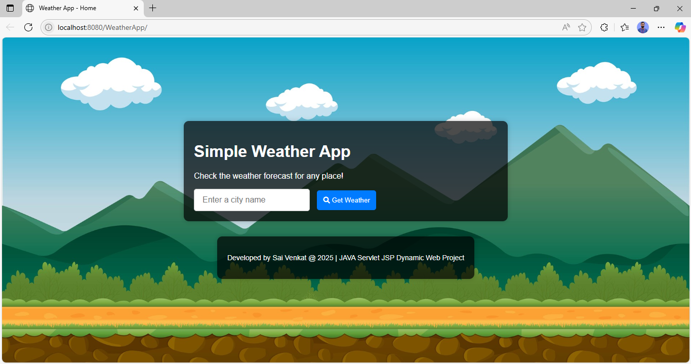
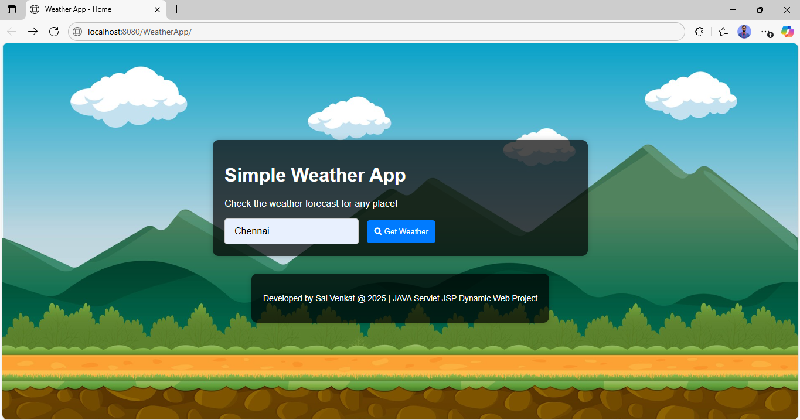
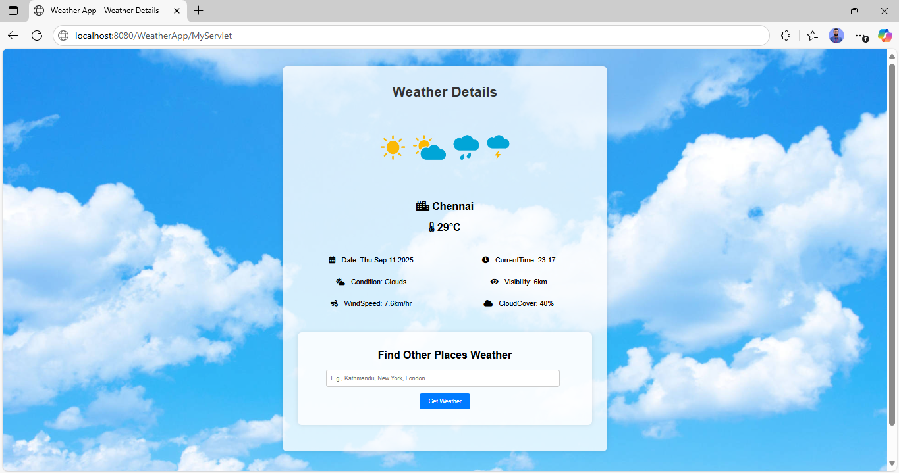

<p align="center">
  
  
  
  
  
</p>

<h1 align="center">🌤️ Java Weather Web Application</h1>

<p align="center">
  <strong>A full-stack Java web application built with Servlets, JSP, and the OpenWeatherMap API to deliver real-time weather forecasts.</strong>
</p>

---

## 📖 Table of Contents
- [Description](#-description)
- [Screenshots](#-screenshots)
- [Features](#-features)
- [Architecture & Workflow](#%EF%B8%8F-architecture--workflow)
- [Technologies Used](#-technologies-used)
- [Setup Instructions](#%EF%B8%8F-setup-instructions)
- [API Integration Details](#-api-integration-details)
- [Author](#-author)

---

## 📝 Description
WeatherApp is a robust, dynamic Java-based web application that fetches and displays real-time weather data. It is developed using **Java Servlets**, **JavaServer Pages (JSP)**, HTML, CSS, and JavaScript. By integrating seamlessly with the **OpenWeatherMap API**, the application dynamically updates based on the user's city input, returning essential meteorological data like temperature, humidity, wind speed, and visibility.

---

## 📸 Screenshots

| Home Page / Search | Weather Data Display | Detailed Metrics |
| :---: | :---: | :---: |
|  |  |  |

---

## ✨ Features
- **Real-Time Data Fetching:** Instantly retrieves live weather data based on the provided city name.
- **Comprehensive Metrics:** Displays detailed current weather conditions including:
  - 🌡️ Temperature
  - 💧 Humidity
  - 💨 Wind Speed
  - 👁️ Visibility
  - ☁️ Cloud Cover
- **Dynamic UI:** A clean, responsive front-end built with HTML, CSS, and JavaScript.
- **MVC Pattern Structure:** Separates business logic (Servlet) from the presentation layer (JSP).

---

## ⚙️ Architecture & Workflow

1. **Client Request:** The user submits a city name via the HTML form on `index.jsp`.
2. **Controller (Servlet):** `MyServlet.java` handles the HTTP POST request.
3. **API Integration:** The Servlet constructs an API call to OpenWeatherMap using `HttpURLConnection`.
4. **Data Parsing:** The JSON response is parsed into Java objects using the **Gson** library.
5. **Data Transfer:** Weather attributes are mapped and set to `HttpServletRequest` attributes.
6. **View (JSP):** The request is forwarded to `index.jsp`, where Expression Language (EL) is used to render the data dynamically.

---

## 💻 Technologies Used

**Backend:**
- Java Servlets (Controller & Business Logic)
- Gson Library (JSON Parsing)

**Frontend:**
- JavaServer Pages (JSP) (Dynamic Views & EL)
- HTML5 & CSS3 (Structure & Styling)
- JavaScript (Client-side interactivity)

**Server & Tools:**
- Apache Tomcat 10.x (Web Server / Servlet Container)
- Eclipse IDE / IntelliJ IDEA
- OpenWeatherMap REST API

---

## 🛠️ Setup Instructions

### Prerequisites
- Java Development Kit (JDK) 11 or higher
- Apache Tomcat 10.1.x
- Eclipse IDE for Enterprise Java (or IntelliJ IDEA Ultimate)
- OpenWeatherMap API Key

### Installation Steps

1. **Clone the Repository**
   ```bash
   git clone https://github.com/naamsanamone/WeatherApp.git
   ```

2. **Configure IDE & Server**
   - Open Eclipse IDE.
   - Go to `Window` -> `Preferences` -> `Server` -> `Runtime Environments`.
   - Click `Add`, select `Apache Tomcat v10.1.x`, and point to your Tomcat installation directory.

3. **Import Project**
   - Go to `File` -> `Import` -> `Existing Projects into Workspace`.
   - Select the cloned `WeatherApp` directory.

4. **Add Gson Dependency**
   - Ensure `gson-x.x.x.jar` is present in `src/main/webapp/WEB-INF/lib`.
   - If missing, download it and manually add it to the project's Build Path.

5. **Configure API Key**
   - Sign up at [OpenWeatherMap](https://openweathermap.org/) to get an API key.
   - Open `src/main/java/MyPackage/MyServlet.java`.
   - Replace the placeholder `myApiKey` with your actual API key:
     ```java
     String apiKey = "YOUR_ACTUAL_API_KEY_HERE";
     ```

6. **Run the Application**
   - Right-click the project in Eclipse -> `Run As` -> `Run on Server`.
   - Select your configured Tomcat instance.
   - Access the app at: `http://localhost:8080/WeatherApp`

---

## 🔌 API Integration Details

### HTTP Request
- Utilizes `java.net.HttpURLConnection` to establish a `GET` request to the OpenWeatherMap API endpoint.
- Reads the response via `InputStreamReader` and `Scanner`.

### JSON Processing
- The raw JSON string is parsed into a `JsonObject` using Google's **Gson** library.
- Extracts deeply nested fields (e.g., `main.temp`, `wind.speed`, `weather[0].main`).

### Dispatching
- The parsed values are passed to the frontend using `request.setAttribute()`.
- Uses `RequestDispatcher.forward(request, response)` to seamlessly render `index.jsp` without a redirect.

---

## 👨‍💻 Author

**Sai Venkat**
- GitHub: [@naamsanamone](https://github.com/naamsanamone)

---

<p align="center">
  <sub>Developed with Java, Servlets, and the OpenWeather API.</sub>
</p>
